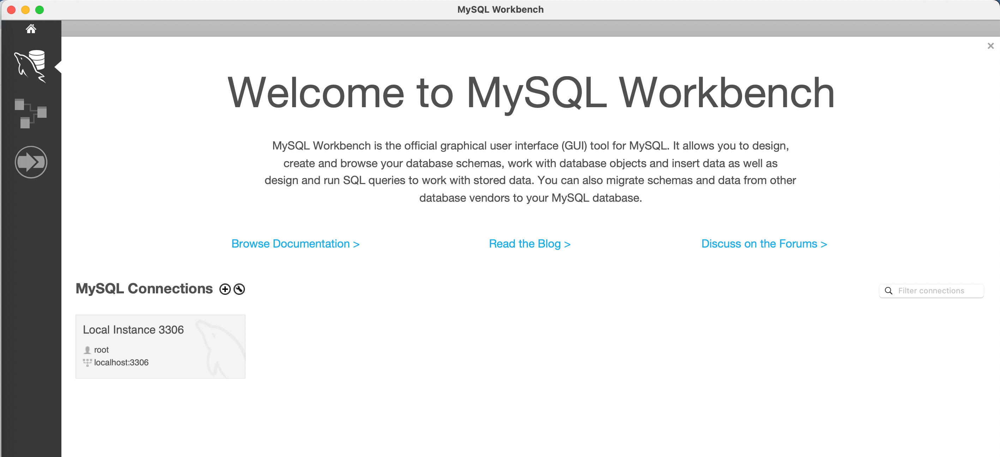
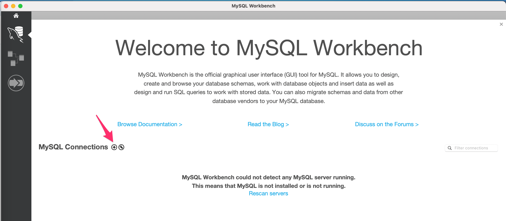
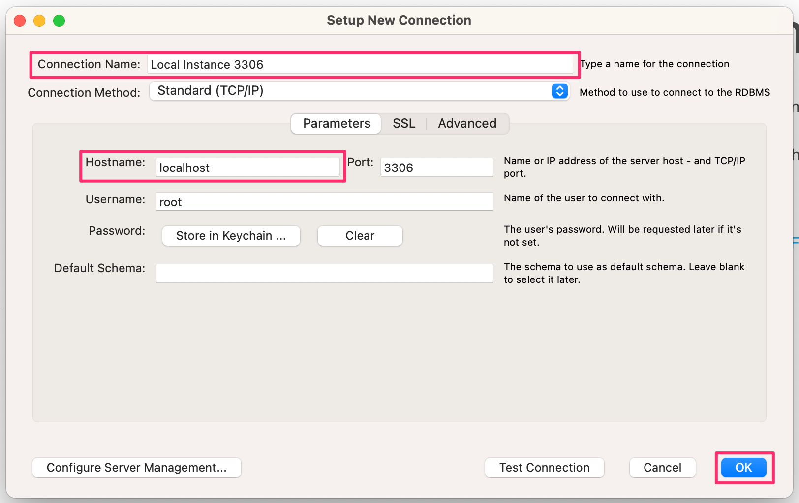

# Create a schema

## Overview
In this section, you will create a new schema in your local instance. This step takes only a few minutes.

## Open a connection
1. Open SQL Workbench. 
    
    If MySQL server is already running, then you should see a screen like below.
    

2. Click on the Connection "Local Instance 3306" shown on the Welcome page.

## Set up a new connection (optional)
If you do not have a connection shown on your Welcome page, follow the steps to set a new connection.

1. Press "+" button on Welcome page.
    

1. Set **Connection Name** and **Hostname** as `localhost` , and click "OK".
    

    !!! info

        You can leave other fields as they are.

3. Click on the connection that you have just created to open it.

    !!! info

        You may be asked for a password, then enter the password you set when installing MySQL.

## Create a new schema
1. Click schema icon at the upper left corner of the window.
1. Set schema name at Schema Editor and click "Apply".

1. Click "Apply" on the popup window.

1. Close the popup window. 

## Conclusion

Now you successfully created a schema with a name you set. You can find your schema on schemas tab in the left column of MySQL workbench.