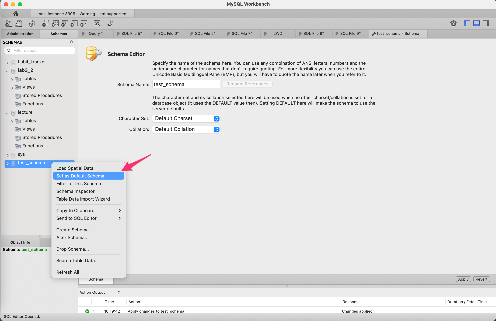
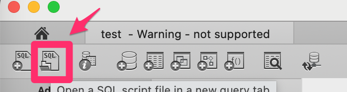
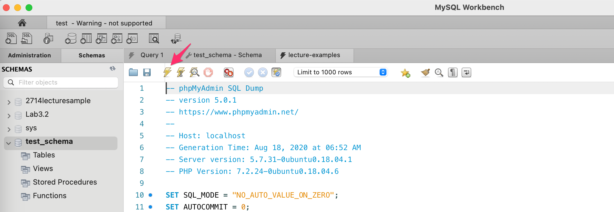
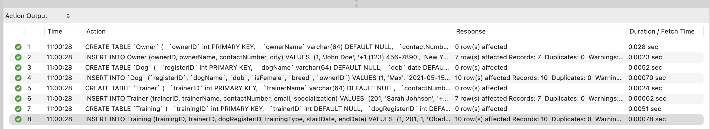
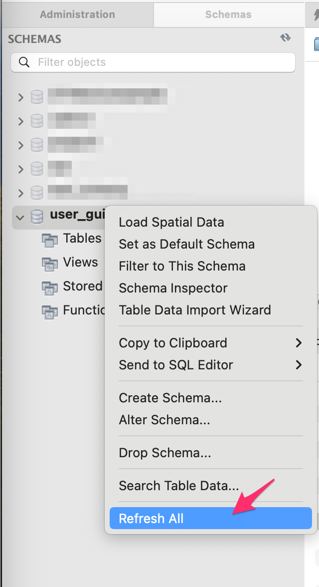
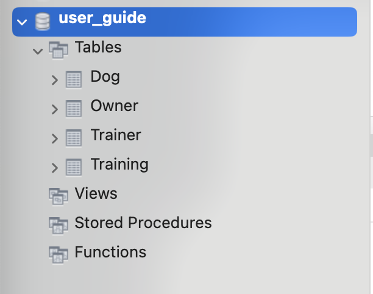

# Create test tables

## Overview
In this section, you will create new tables in your local instance. You can also populate sample data to the tables.
This step takes only a few minutes.

## Before starting
You should have a schema created by following [the previous section](/docs/create_new_schema.md).


## Create new tables

1. Right-click on the schema you created, and choose "Set as Default Schema".


    !!! warning

        If you don't do this, you might mistakenly run queries on the wrong schema!
        
2. Click "File" > "New Query tab" to open a new query tab.
3. Write queries to create tables on the editor. If you want to use SQL file, click the SQL file button from the task bar.</br>


1. Write queries to create constraints on the editor.

    If you want to crete test tables, you can use the sample query below.


    ??? example "Example code for tables"
        ``` SQL
        CREATE TABLE `Owner` (
        `ownerID` int PRIMARY KEY, 
        `ownerName` varchar(64) DEFAULT NULL,
        `contactNumber` varchar(20) DEFAULT NULL,
        `city` varchar(20) DEFAULT NULL
        );

        CREATE TABLE `Dog` (
        `registerID` int PRIMARY KEY,
        `dogName` varchar(64) DEFAULT NULL,
        `dob` date DEFAULT NULL,
        `isFemale` bool DEFAULT true,
        `breed` char(64) DEFAULT NULL,
        `ownerID` int NOT NULL,
        FOREIGN KEY (ownerID) REFERENCES Owner(ownerID)
        );

        CREATE TABLE `Trainer` (
        `trainerID` int PRIMARY KEY,
        `trainerName` varchar(64) DEFAULT NULL,
        `contactNumber` varchar(20) DEFAULT NULL,
        `email` varchar(64) DEFAULT NULL,
        `specialization` varchar(20) DEFAULT NULL
        );

        CREATE TABLE `Training` (
        `trainingID` int PRIMARY KEY,
        `trainerID` int DEFAULT NULL,
        `dogRegisterID` int DEFAULT NULL,
        `trainingType` varchar(50) DEFAULT NULL,
        `startDate` date DEFAULT NULL,
        `endDate` date DEFAULT NULL,
        FOREIGN KEY (dogRegisterID) REFERENCES Dog(registerID),
        FOREIGN KEY (trainerID) REFERENCES Trainer(trainerID)
        );
        ```

5. Click a left thunder icon to run the queries.


    !!! warning

        You only have to run the queries once.


        You will see the status of queries in Action Output. 
        Green check marks mean good, yellow triangles mean warning. Red is error.


    


6. Right-click on the schema you created and select "Refresh All" to refresh the schema.</br>


7. Click the triangle to see a table list you have created.</br>


8. Close the editor tab where you wrote the queries.


## Populate sample data

1. Write INSERT statement about the data you want to populate.

    !!! info
        If you want to populate date using sample, you can use the sample query below.


    ??? example "Example code for population"
        ``` SQL
        INSERT INTO Owner (ownerID, ownerName, contactNumber, city) VALUES 
        (1, 'John Doe', '+1 (123) 456-7890', 'New York'),
        (2, 'Alice Smith', '+1 (234) 567-8901', 'Los Angeles'),
        (3, 'Michael Johnson', '+1 (345) 678-9012', 'Chicago'),
        (4, 'Emily Brown', '+1 (456) 789-0123', 'Houston'),
        (5, 'David Wilson', '+1 (567) 890-1234', 'Philadelphia'),
        (6, 'Emma Martinez', '+1 (678) 901-2345', 'Phoenix'),
        (7, 'Olivia Davis', '+1 (789) 012-3456', 'San Antonio');


        INSERT INTO `Dog` (`registerID`, `dogName`, `dob`, `isFemale`, `breed`, `ownerID`) VALUES
        (1, 'Max', '2021-05-15', false, 'Dachshund', 1),
        (2, 'Bella', '2018-05-20', true, 'Golden Retriever', 2),
        (3, 'Charlie', '2019-09-10', false, 'Poodle', 3),
        (4, 'Luna', '2021-03-25', true, 'Shih Tzu', 4),
        (5, 'Cooper', '2017-11-08', false, 'German Shepherd', 5),
        (6, 'Lucy', '2020-07-03', true, 'Beagle', 6),
        (7, 'Bailey', '2018-12-12', false, 'Siberian Husky', 7),
        (8, 'Daisy', '2019-04-30', true, 'Boxer', 2),
        (9, 'Rocky', '2016-08-17', false, 'Pug', 7), 
        (10, 'Molly', '2022-01-10', true, 'Border Collie', 1);


        INSERT INTO Trainer (trainerID, trainerName, contactNumber, email, specialization) VALUES 
        (201, 'Sarah Johnson', '+1 (111) 222-3333', 'sarah@example.com', 'Agility'),
        (202, 'Michael Brown', '+1 (222) 333-4444', 'michael@example.com', 'Behavioral'),
        (203, 'Emily Wilson', '+1 (333) 444-5555', 'emily@example.com', 'Obedience'),
        (204, 'Daniel Taylor', '+1 (444) 555-6666', 'daniel@example.com', 'Agility'),
        (205, 'Jessica Martinez', '+1 (555) 666-7777', 'jessica@example.com', 'Obedience'),
        (206, 'Ryan Thomas', '+1 (666) 777-8888', 'ryan@example.com', 'Agility'),
        (207, 'Lauren Harris', '+1 (777) 888-9999', 'lauren@example.com', 'Behavioral');


        INSERT INTO Training (trainingID, trainerID, dogRegisterID, trainingType, startDate, endDate) VALUES 
        (1, 201, 1, 'Obedience', '2023-05-10', '2023-05-24'), 
        (2, 202, 2, 'Behavioral', '2023-06-02', '2023-06-16'), 
        (3, 203, 3, 'Obedience', '2023-06-15', '2023-06-29'),
        (4, 204, 4, 'Agility', '2023-07-05', '2023-07-19'), 
        (5, 205, 5, 'Obedience', '2023-08-20', '2023-09-03'),
        (6, 206, 6, 'Agility', '2023-09-10', '2023-09-24'), 
        (7, 207, 7, 'Behavioral', '2023-10-05', '2023-10-19'), 
        (8, 201, 1, 'Agility', '2023-11-15', '2023-11-29'), 
        (9, 202, 2, 'Obedience', '2023-12-02', '2023-12-16'), 
        (10, 203, 3, 'Agility', '2024-01-10', '2024-01-24'); 

        ```


1. Click a left thunder icon to run the queries in the same manner.


    !!! warning
        You only have to run the queries once.


    You will see the status of queries in Action Output. Green check marks mean good, yellow triangles mean warning. Red is error.

3. Right-click on the schema you created and select "Refresh All" to refresh the schema.

!!! success

    Now you successfully created new tables.