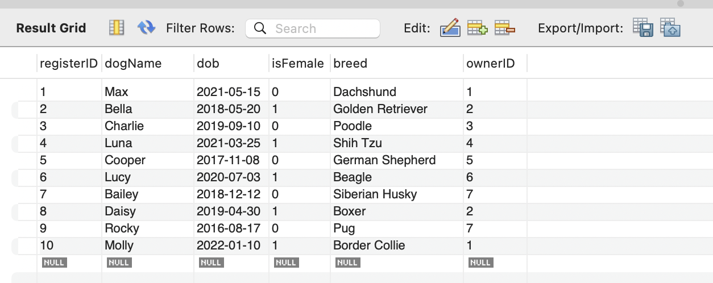
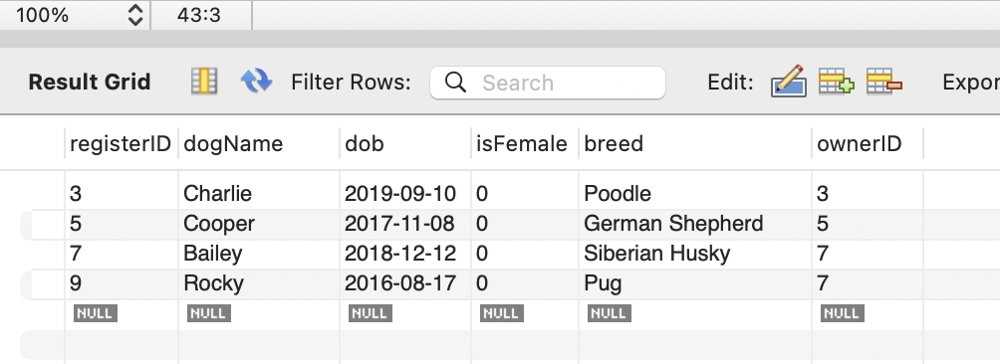
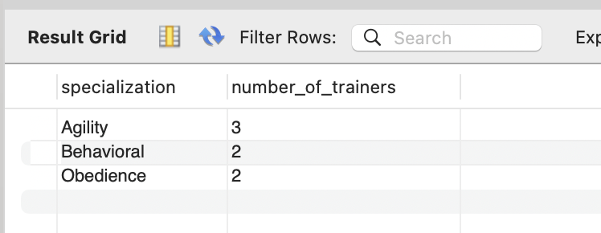
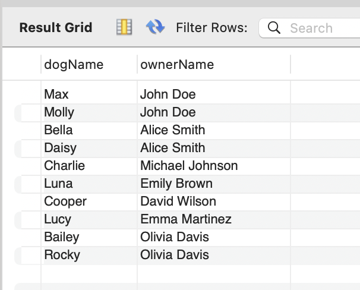

# Retrieve information from tables

## Overview
In this section, you will extract data with SELECT statements. A SELECT statement is a SQL query used to extract information from tables. 
With SELECT statements, you can do the following:

- filter data with certain conditions
- sort data by certain attributes
- aggregate data (e.g. calculating sum, average and maximum values)
- join tables

We will cover these operations with sample queries.


We will introduce the basic syntax for SELECT statements needed for data extraction. For more information, you can refer to [MySQL official documentation](https://dev.mysql.com/doc/refman/8.0/en/select.html){target="-blank"}.

### Selecting columns

In SELECT statements, you can select columns to be shown in the result by listing the column name. The result of the query below only shows column1 and column2 for all data in table1. If you want to show all columns, use `*` instead of the column names.

``` sql
SELECT column1, column2
FROM table1;
```

### Adding conditions

In SELECT statements, you can add conditions with `WHERE` clause. The result of the query below shows only data with a value 1 in column1.

``` sql
SELECT * 
FROM table1 
WHERE column1 = 1;
```

### Sorting
In SELECT statements, you can sort the result with `ORDER BY` clause.shows data in table1 in an ascending order by column1. If you want to sort the result with a descending order, add `DESC` after `ORDER BY` clause like `ORDER BY column1 DESC`.

``` sql
SELECT * 
FROM table1 
ORDER BY column1;
```

### Aggregation
For aggregation, you can use aggregation functions such as `SUM()` for calculating a total value, `COUNT()` for counting the number of rows, `AVG()` for calculating an average value. This query below returns the number of rows and the total added value of column1.
``` sql
SELECT SUM(column1), COUNT(column1)
FROM table1;
```

## Preparation

Open a new query tab by clicking "File" > "New Query Tab"

!!! success

    Now you are ready to write queries.

## Operations
### Extracting all dogs in Dog table

1. Copy and paste the sample query.

    !!! example "Sample query"
        ```
        SELECT * 
        FROM Dog;
        ```

1. Click the left thunder icon to run the query.

    You will see the result in the result grid.</br>



### Extracting male dogs born before 2020

1. Copy and paste the sample query.

    !!! example "Sample query"
        ``` sql
        SELECT * 
        FROM Dog
        WHERE isFemale = 0 AND dob < '2020-01-01';
        ```


1. Click the left thunder icon to run the query.

    You will see the result in the result grid.</br>


### Getting the number of trainers grouped by their specialization

1. Copy and paste the sample query.

    !!! example "Sample query"
        ``` sql
        SELECT specialization, count(*) AS number_of_trainers
        FROM Trainer
        GROUP BY specialization;
        ```

1. Click the left thunder icon to run the query.

    You will see the result in the result grid.</br>



### Getting the combination of dogs and owners
1. Copy and paste the sample query.

    !!! example "Sample query"
        ``` sql
        SELECT dogName, ownerName
        FROM Dog
        JOIN `Owner` ON Dog.ownerID = `Owner`.ownerID;
        ```

1. Click the left thunder icon to run the query.

    You will see the result in the result grid.</br>


## Conclusion
Now you can retrieve information from tables with SELECT statements.